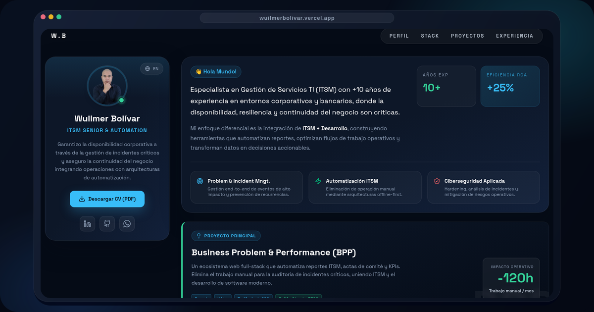

# Wuilmer Bolívar | Portafolio Interactivo



Este es el repositorio del código fuente del portafolio interactivo de Wuilmer Bolívar. Desarrollado con tecnologías modernas enfocadas en el rendimiento, accesibilidad, y un diseño enfocado al usuario final.

## 🔗 Enlaces Profesionales

* **LinkedIn**: [https://www.linkedin.com/in/wuilmerbolivar/](https://www.linkedin.com/in/wuilmerbolivar/)
* **GitHub**: [https://github.com/wuilmerbolivar](https://github.com/wuilmerbolivar)
* **Portafolio**: [https://www.wuilmerbolivar.lat/](https://www.wuilmerbolivar.lat/)

## 📊 Impacto del Proyecto

* **Optimización**: Automatización de reportes ITSM.
* **Rendimiento**: -120h de impacto operativo ahorradas.
* **Stack**: Arquitectura offline-first y diseño resiliente.

## ✨ Tecnologías Utilizadas

* **React 18**: Librería principal para la interfaz de usuario.
* **Vite**: Herramienta de compilación ultrarrápida.
* **Tailwind CSS**: Framework de utilidades para el diseño visual.
* **TypeScript**: Tipado estático para código robusto y mantenible.
* **Framer Motion**: (motion/react) Animaciones fluidas y accesibles.
* **Recharts**: Gráficos interactivos de datos.
* **Lucide React**: Iconografía ligera y escalable.

## 🚀 Uso, Clonación y Personalización

Sigue estos pasos para clonar, ejecutar y personalizar el proyecto en tu entorno local.

### 1. Clonar el repositorio

```bash
git clone https://github.com/wuilmerbolivar/portafolio.git
cd portafolio
```

### 2. Instalar dependencias

Asegúrate de tener instalado [Node.js](https://nodejs.org/) (versión 18 o superior).

```bash
npm install
```

### 3. Servidor de Desarrollo

```bash
npm run dev
```

Esto iniciará el servidor de desarrollo en el puerto configurado (ej: `http://localhost:3000` o `http://localhost:5173`).

## 🛠️ Estructura y Personalización

El proyecto está diseñado para ser altamente modular:

* **`/src/data.ts`**: Aquí se centralizan los datos como la línea de tiempo de experiencia y el Stack tecnológico. Modificar este archivo actualizará directamente el contenido.
* **`/src/context/LanguageContext.tsx`**: Contiene todo el diccionario de traducciones (`es` y `en`).
* **`/src/components/`**: Los componentes principales (`Hero`, `Experience`, `Projects`, `TechStack`, `Contact`, `Testimonials`).
* **`tailwind.config.js`** / **`index.css`**: Puedes modificar los colores, la tipografía y variables de temas.

## 🚀 Despliegue (Deployment)

Puedes desplegar esta aplicación fácilmente en servicios gratuitos como Vercel o Netlify.

**Para generar el build de producción:**

```bash
npm run build
```

Generará una carpeta `/dist` con los archivos optimizados listos para ser servidos.

## 📝 Política de Uso y Licencia

Este proyecto se comparte bajo la licencia **Creative Commons Atribución (CC BY)**.

Esto significa que puedes **compartir, reutilizar y adaptar** el contenido y el código fuente, **incluso con fines comerciales**, siempre que otorgues el crédito correspondiente al autor original.

Al reutilizar o derivar este trabajo, debes incluir una atribución visible a **Wuilmer Bolívar** dentro del código, la documentación o la plataforma final donde se publique la adaptación.
